Our third week focused on digital elevation models of Mt. Kilimanjaro in SAGA.  This began with aster data courtesy of [NASA Earthdata](https://earthdata.nasa.gov/) for elevation and created a model of streamflow from this elevation data.

The lab began with integrating the two sections of the map which visualized Mt. Kilimanjaro to the scale.

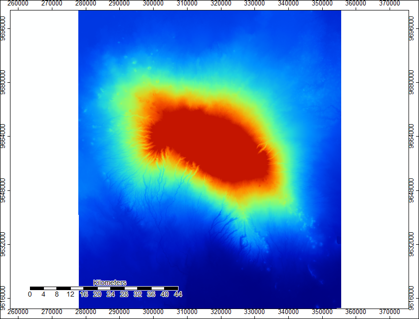  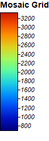

After the creation of a unified study area, we created a shaded visualization of the area that easily shows elevation.

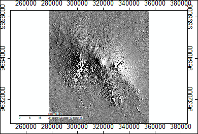 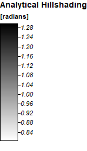

Following this elevation shading, we utilized SAGA's sink detection function to identify possible holes of flow to remove these from our final product.

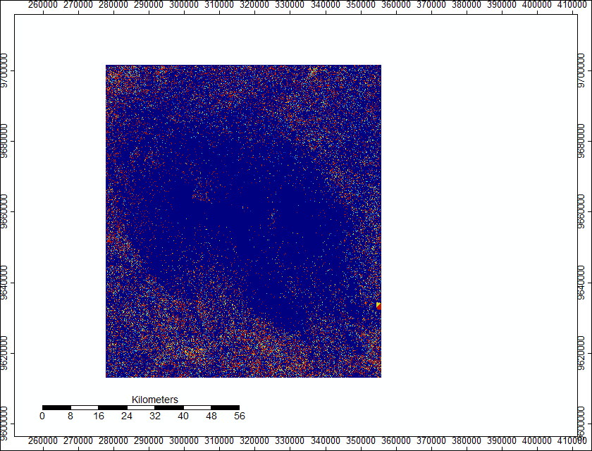 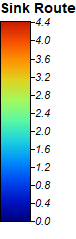

Then, we removed these sinks from our area by filling them to ensure smooth flow lines.

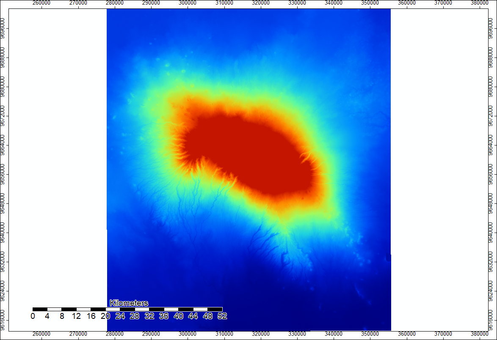 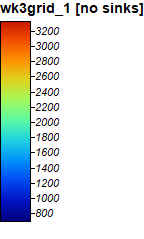

Then, we calculated flow accumulation to determine the quantity of flow given a cell and its surrounding elevation.

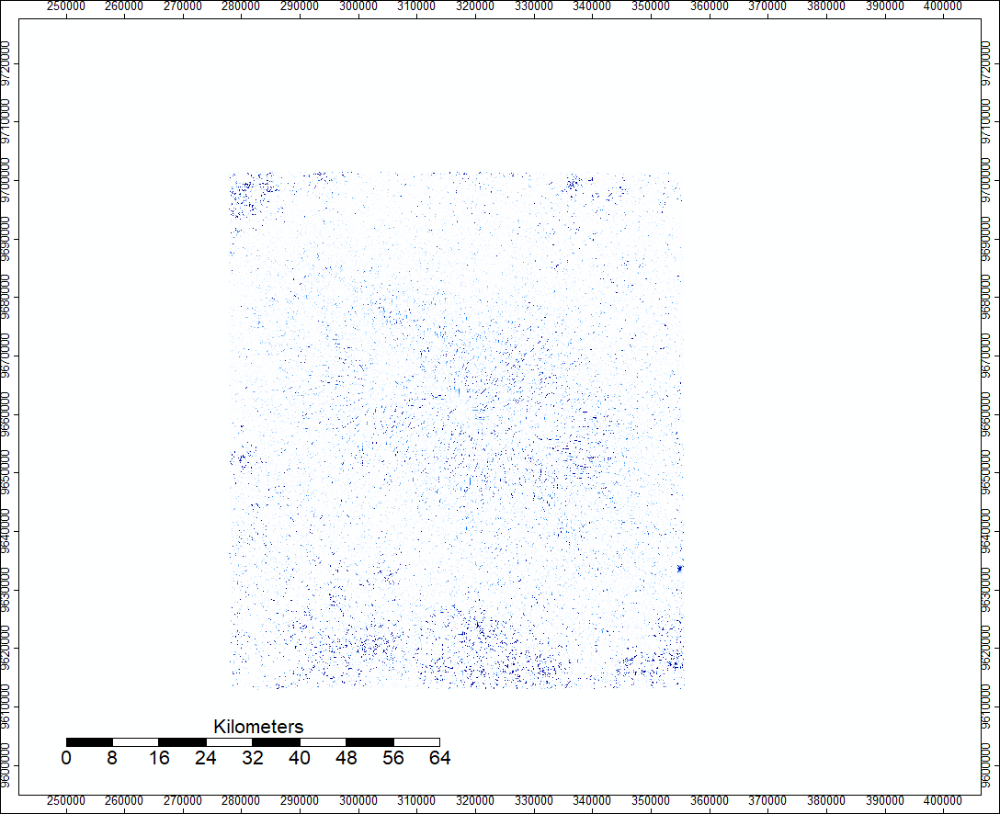 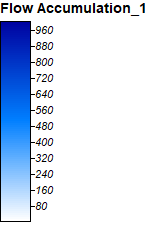

Finally, we visualized the channel network of water flow in the area around Kilimanjaro on top of the shaded elevation.

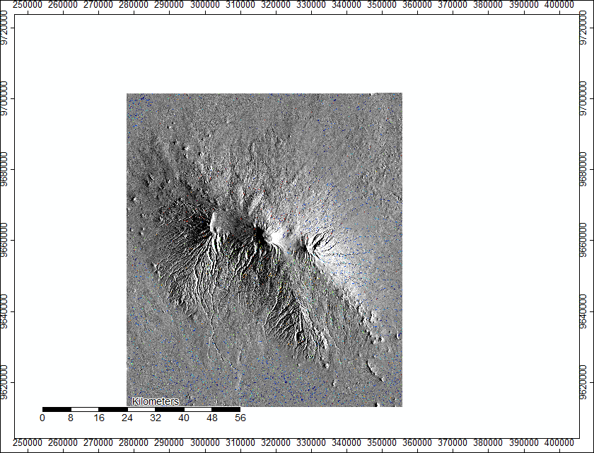 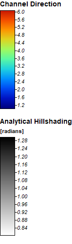

The ultimate image is the ultimate visualization of the flow of streams and rivers as would be estimated by elevation data from Mt Kilimanjaro.

In our fourth week, we updated this process to automate the production of channel networks using a batch script, which can be found [here](BatchAst.bat) for aster data and [here](BatchSRTM.bat) for SRTM data.  This modelling was performed on both ASTER and SRTM data, both of which come with their own sets of uncertainty.  Pictured below are the results of both of these analyses and the difference between them visualized.  The data again came from [NASA Earthdata](https://earthdata.nasa.gov/), this time using both the Aster and SRTM data for Mt. Kilimanjaro, though these scripts can be applied to any elevation data.  This particular batch script utilzed SAGA 6.2 but could be altered for different versions and systems.  The process of creating the batch script was relatively simple, the same steps from above were simply automated to create the channels of water flow around Kilimanjaro.  

The image below illustrates discrepancies in the recorded elevations of the Aster and SRTM data, owing to their different methods of collection.  Higher Aster Data is represented in blue whereas higher SRTM data is represented in red.

  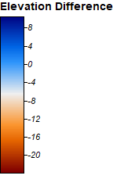

Below are three-dimensional models of the elevations with their channel networks visualized.  The first is for Aster and the second for SRTM.

![3DAst(3dast.PNG)

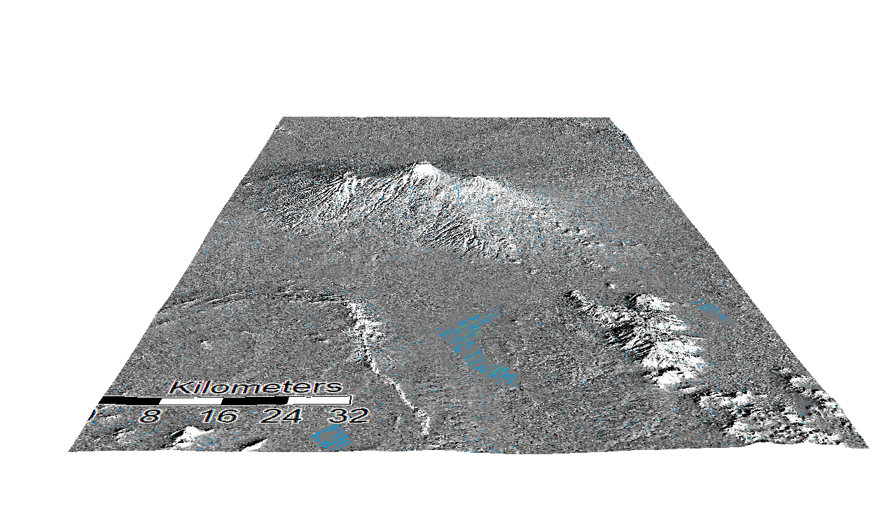

Finally, below is an image of the difference between the flow accumulations of the Aster and SRTM data, where data leaning toward Aster is ... and data leaning toward SRTM is ......

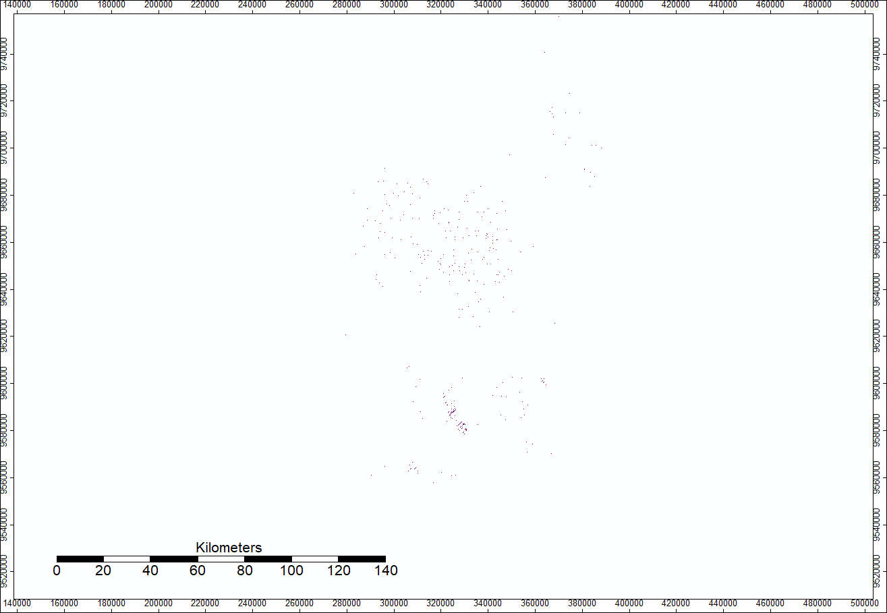   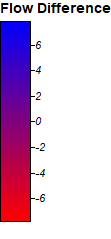

The above image demonstrates the 

Data Sources: NASA/METI/AIST/Japan Spacesystems, and U.S./Japan ASTER Science Team. ASTER Global Digital Elevation Model V003. 2019, distributed by NASA EODIS Land Processes DAAC

NASA JPL. NASA Shuttle Radar Topography Mission Global 1 arc second. 2013, distributed by NASA EOSDIS Land Processes DAAC

