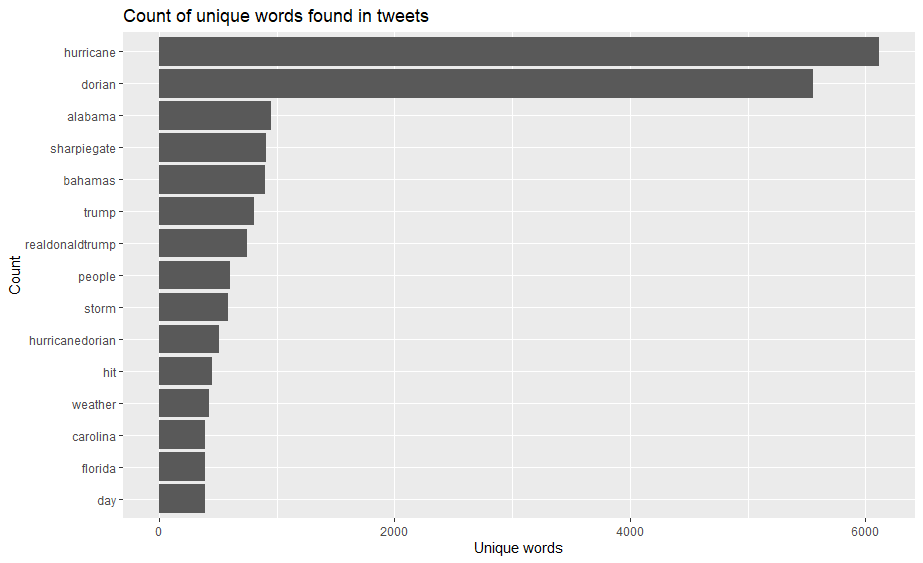
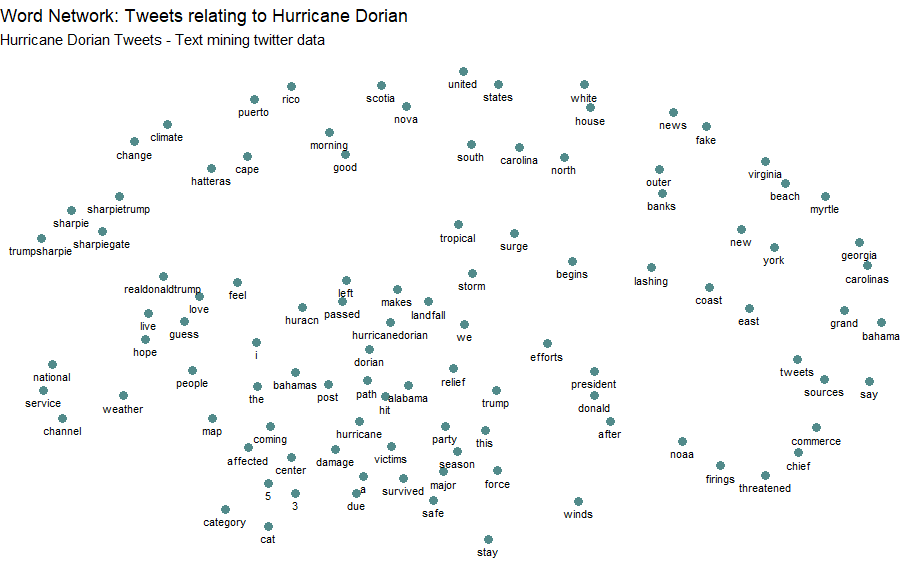

### Hurrican Dorian Lab
Our final lab looked at the relationship of tweets about Hurricane Dorian in the context of the actual path of the hurricane versus the projected path proposed on President Trump's twitter during 'sharpiegate'.  We used a variety of spatial visualizations to try to determine what effect, if any, sharpiegate had on tweets about Hurricane Dorian.

We conducted analysis in RStudio which then allowed us to statistically analyze the presence of tweets on Dorian specifically versus general twitter activity.  Following the gathering and initial analysis of data in R, we transitioned to QGIS to conduct statistical analysis on the data gathered initially.  Finally we picture these statistical results in GeoDa, which allows a final visualization of the effect (or lack of) which 'sharpiegate' had on tweets conducted during this period.

# Methodology in R
The first step in conducting this analysis was to gather the necessary data from twitter.  This was conducted in RStudio, with the script provided [here](dorianTwitterScript.R) by Professor Holler to get the data for general November tweets and those relating to Dorian on September 11, 2019, with a sample of 200000 tweets each.  With the necessary tweets acquired, we began to look at the common language and word associations of the tweets, which can be found [here](lab10script.R). This script also downloaded county level census data for the entire United States, which we used for statistical analysis in out PostGIS databases.  Below, are the two visualizations of language created by the script.

This is a graph of the most used words in tweets relating to Hurricane Dorian on September 11, 2019.

This is a network analysis of the tweets described above, which attempts to relate the most used words spatially, creating a look into how words were used in relation to each other.

# PostGIS and QGIS
After completing our work in RStudio, we transitioned to the PostGIS function in QGIS, using the final section of the R script attached above to transition our data from R to the PostGIS database. The SQL script for work conducted in the PostGIS database can be found [here](lab10sql.sql).  While the step by step is included in the script, generally speaking, it strove to integrate the twitter data into the county to which it would belong.  By creating county level data for the november tweets and the dorian tweets, they could be intersected with the counties and then integrated into them.  Then, we counted the tweets in each county in order to calculate the density of tweets per county and calculated the normalized tweets per county to create a framework for our later spatial analysis.

Then, in QGIS we created a kernel density map of twitter activity.  First we changed all of the counties in our study region to points by finding their centroids so the map could be produced.  We calculated the kernel density with QGIS with a radius of 100 km, to allow for slight overlap, pizel size of 500 m, and the map weighted by the tweet rate column calculated using the script above.  This created the map below, with a relatively smooth image of kernel density.

# GeoDa
Following this, we conducted other spatial analyses in GeoDa.  By connecting with our PostGIS database, we were able to create a spatial weights matrix, separated by geoid for each county, based on the twitter data we created in QGIS.  Then we calculated the G* cluster map, using our calculated tweet rate as the variable.  Below, you can see the spatial analysis for both the ordinary tweet rate and the normalized tweet rates.

# Discussion
Cumulatively, the results of this lab demonstrate that sharpiegate did have a somewhat noticeable effect on the subjects about which people tweeted during 

[Return to homepage](pdickson.github.io)
