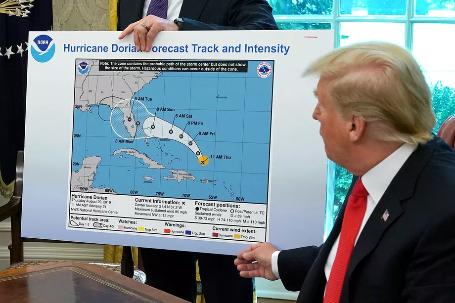
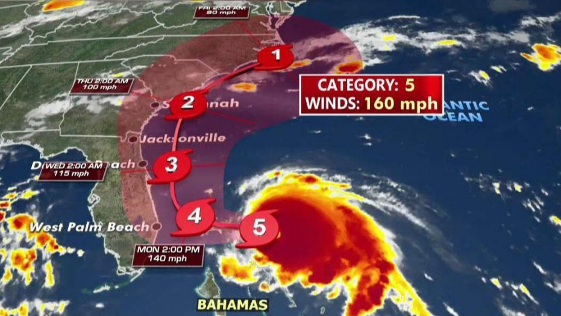
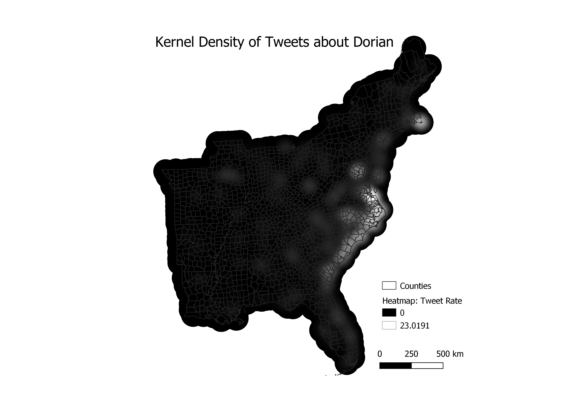
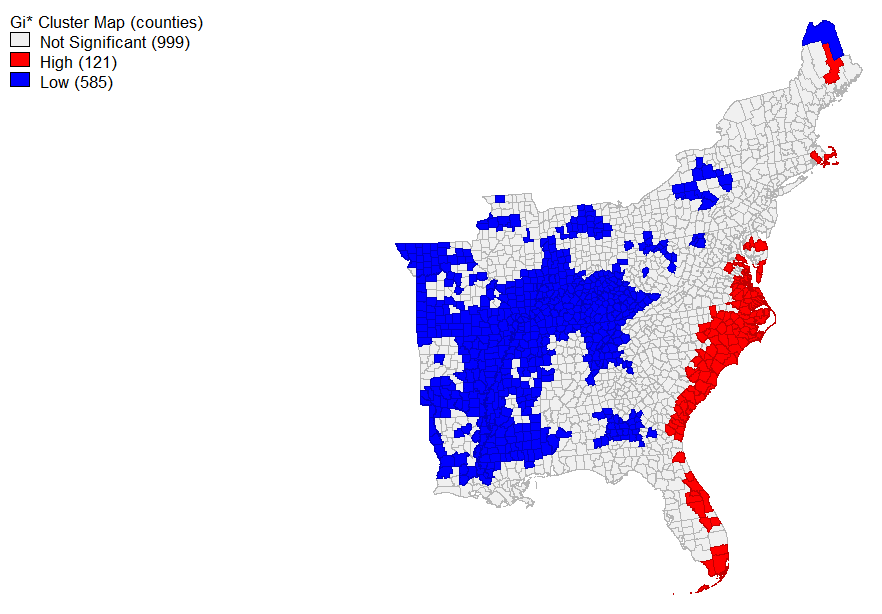

# Hurrican Dorian Lab
In the first week of September 2019, Hurricane Dorian decimated the Bahamas and was set to hit the southeastern United 
States.  However, President Trump stirred up much controversy that week online with claims that the storm could possible reach as far as Alabama, with the now infamous map seen below including a seemingly drawn on extension of the path proposed by NOAA.  The map presented by President Trump and the actual path of Hurricane Dorian are both visualized below. Our final lab looked at the relationship of tweets about Hurricane Dorian in the context of the actual path of the hurricane versus the projected path proposed on President Trump's twitter during 'sharpiegate', using general tweets gathered from the month of November as control tweets.  We used a variety of spatial visualizations to try to determine what effect, if any, sharpiegate had on tweets about Hurricane Dorian.

We conducted analysis in RStudio which then allowed us to analyze the presence of tweets on Dorian specifically versus general twitter activity and to get of sense of the content of these tweets.  Following the gathering and initial analysis of data in R, we transitioned to QGIS to conduct statistical analysis on the data gathered initially.  Finally we picture these statistical results in GeoDa, which allows a final visualization of the effect (or lack of) which 'sharpiegate' had on tweets conducted during this period.

## Methodology 
### RStudio
The first step in conducting this analysis was to gather the necessary data from twitter.  This was conducted in RStudio, with the script provided [here](dorianTwitterScript.R) by Professor Holler to get the data for general November tweets and those relating to Dorian on September 11, 2019, with a sample of 200000 tweets each.  With the necessary tweets acquired, we began to look at the common language and word associations of the tweets, which can be found [here](lab10script.R). This script also downloaded county level census data for the entire United States, which we used for statistical analysis in out PostGIS databases.  Below, are the two visualizations of language created by the script.

This is a graph of the most used words in tweets relating to Hurricane Dorian on September 11, 2019.

This is a network analysis of the tweets described above, which attempts to relate the most used words spatially, creating a look into how words were used in relation to each other.

### PostGIS and QGIS
After completing our work in RStudio, we transitioned to the PostGIS function in QGIS, using the final section of the R script attached above to transition our data from R to the PostGIS database. The SQL script for work conducted in the PostGIS database can be found [here](lab10sql.sql).  While the step by step is included in the script, generally speaking, it strove to integrate the twitter data into the county to which it would belong.  By creating county level data for the november tweets and the dorian tweets, they could be intersected with the counties and then integrated into them.  Then, we counted the tweets in each county in order to calculate the density of tweets per county and calculated the normalized tweets per county to create a framework for our later spatial analysis.

Then, in QGIS we created a kernel density map of twitter activity.  First we changed all of the counties in our study region to points by finding their centroids so the map could be produced.  We calculated the kernel density with QGIS with a radius of 100 km, to allow for slight overlap, pizel size of 500 m, and the map weighted by the tweet rate column calculated using the script above.  This created the map below, with a relatively smooth image of kernel density.

### GeoDa
Following this, we conducted other spatial analyses in GeoDa.  By connecting with our PostGIS database, we were able to create a spatial weights matrix from the tools menu, weighted by geoid for each county, based on the twitter data we created in QGIS. Then we produced the G* cluster map, first using our calculated tweet rate as the variable and second using the normalized rate, as the variable.  All factors - the significance map, the cluster map, and row-standardized wights - were included.  This calculation conducts the Getis-Ord Gi* statistical analysis: an explanation of which can be found [here](https://geodacenter.github.io/workbook/6a_local_auto/lab6a.html).  Essentially, it creates a map of high and low rates of the entered variable.  Below, you can see the spatial analysis for both the ordinary tweet rate and the normalized tweet rates.

This is the map of the Hotspots of the tweet rate by county.

## Interpretation
Cumulatively, the results of this lab demonstrate that sharpiegate did have a somewhat noticeable effect on the subjects about which people tweeted during the study period.  Our initial study of the major content words of tweets which related directly to Hurricane Dorian demonstrated that many of them were in the broader context of sharpiegate, with the state in question, Alabama, the word sharpiegate, and multiple topics relating to Donald Trump appearing prominantly among these tweets.  However, these tweets do not appear to have the spatial correlation with regions that were exaggerated by President Trump, as seen in the maps of kernel density and tweet rate.  There were certain regions which were more likely to tweet about the hurricane than others, but they were generally those actually affected by the hurricane itself, rather than those predicted to do so.

## Discussion
This analysis brings up many questions of the study of big data in the context of twitter data relating Hurricane Dorian and sharpiegate.  Many issues relating to this topic are addressed by [Crawford and Finn](https://link.springer.com/article/10.1007/s10708-014-9597-z). One main issue relating to this is the sheer quantity of tweets that don't have spatial data or that have uncertain spatial data that then gets localized in spatial analyses.  Another issue discussed in their work is that the demographics of twitter don't necessarily mirror the demographics of the country as a whole.  Therefore, the tweets are subjected to certain biases in opinion and content that don't always reflect the opinions of a nation as a whole.  A final issue discussed in this article is the ethical validity of examining twitter data.  Social media data, while public, is generally not thought of as being open to interpretation when it is publicized.  Often times people put highly personal or sensitive data on their social media with the expectation that it is only available to those who follow them.  Therefore, we need to think very carefully about how we use and publicize this data in order to protect the privacy of the users.  While twitter has built in protections against the blatant publification of personal data, it isn't explicitly prohibited.  

Additionally, while publishing twitter data violates twitter's code of agreement, the ids of the tweets studied can be found [here](dorianTweetIDs.csv), for rehydration.

Software: QGIS 3.8.1, RStudio, GeoDa, PostGIS

[Return to homepage](pdickson.github.io)
