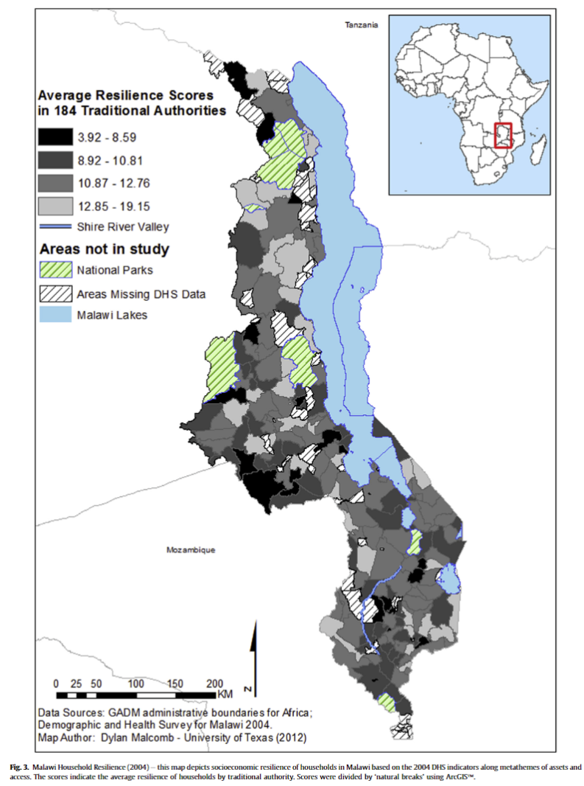
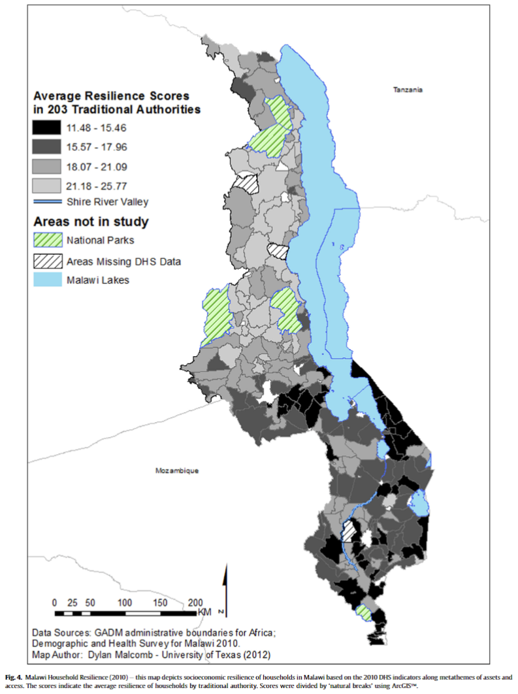
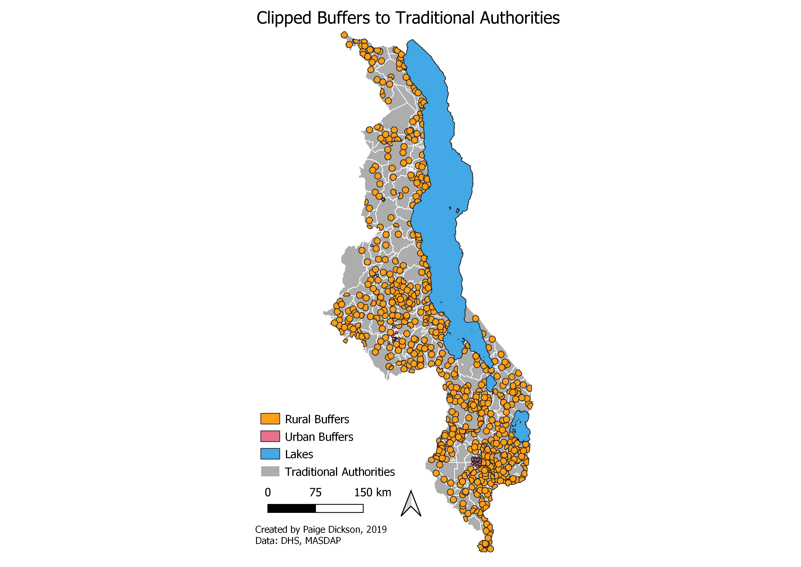
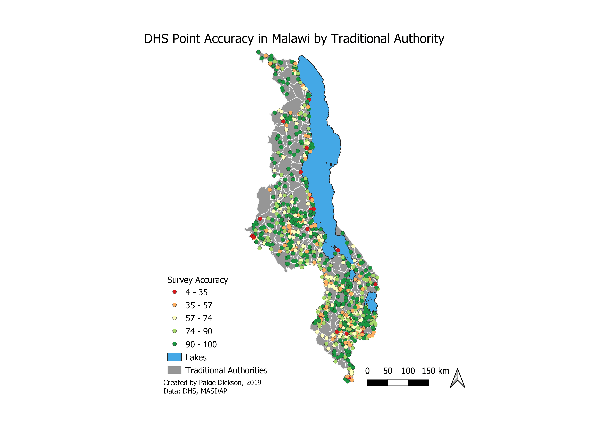

# Final Project

For my final project in this class, I chose to continue looking at the lab we conducted in the seventh and eight weeks of our class, which can be viewed [here](malawi.md).  The initial lab attempted to recreate work conducted by Malcomb et al. in 2014, linked [here](https://reader.elsevier.com/reader/sd/pii/S0143622814000058?token=078A0ACAE18D01995A67473D93E5DC36A07C5779021CF903B8334CF1D7C8EAD9277467C394E80035D5AD73BF0FD401F0).  The paper examines social vulnerability in Malawi as a lens for possible future reseach into the topic. I looked at the uncertainty of one of the initial sources of data for the lab, the locations of the DHS points.  

In order to protect privacy of survey takers, the DHS points were randomized up to 2km for those located in urban areas and up to 5km for those located in rural areas.  While this randomization did not cross over official district boundaries, the scale at which they were measured, they can cross over the traditional authority boundaries, which are used to create the third and fourth figures in the analysis, as seen below.  Therefore, I wanted to look at the probability that each point was misassigned in its randomization to further examine the accuracy of this methodology.

 

The data for this specific part of the analysis are the Demographic and Health survey data, which cannot be published, the Traditional Authorities of Malawi, which can be found [here](http://spatialdata.dhsprogram.com/boundaries/#view=table&countryId=MW) and the major waterways and traditional authorities of Malawi, which can be found at [MASDAP](http://www.masdap.mw/). This analysis was conducted mostly in the PostGIS database manager in QGIS 3.8.1, with the results visualized using QGIS.

## Methodology
Firstly, as the buffers' distance was contingent on the urban/rural status of the point.  While this data is included in the initial DHS points, it is represented as a varchar, which made it unable to be selected in SQL.  To rectify this, before entering my database, I created a new urbanrural column which used an integer classification, then set urban = 1 and rural = 2.

Then, I brought my layers into the PostGIS database manager.  I created the following [sql](final.sql) which explained my methodology in finding the likelihood that each point sits within the correct traditional authority.  While each individual step is detailed in the SQL, a basic synopsis of my methodology is as follows.

 - Create the buffers for the rural (5km) and urban (2km) points
 - Eliminate the area of the buffers that overlaps with waterways
 - Eliminate the area of the buffers which lie in the incorrect district
 - Calculate area of the possible buffer
 - Find the buffer which sits in the correct Traditional Authority
 - Calculate the are of the buffer in the correct TA
 - Add the areas to the survey points and calculate the chance they are correctly located.
 
## Results
The aim of this project was to calculate the likelihood that DHS points taken for Malcomb et al's vulnerability analysis lie within the Traditional Authority of Malawi in which they were represented.  Visualized below are the final buffers which were created for the urban and rural points, with area in water and the incorrect district removed. 
 

 
Below, find a map of the inital DHS points rated for the likelihood they lie within the correct Traditional Authority.  Overall, the average chance that the TA was correct was 80.05%, with urban areas having a 75.57% accuracy and rural areas 80.83%.  
 

## Discussion
This analysis could be taken further by finding the likelihood that each point lies in each TA with which it overlaps.  To do this, instead of solely finding the the area of the intersection in which the point overlaps with the assigned Traditional Authority, the area for each individual part could be found.  From there, the points could be weighted to contribute their calculated vulnerability score to the likelihood that they actually sit within that Traditional Authority with randomization of the points and repreated tests to compile the most accurate picture possible.

Additionally, there are some possible errors with my analysis that I haven't discussed so far.  For one thing, the traditional authorities and districts do not appear to overlap perfectly in their shapefiles, as they come from different sources.  Even when reprojected to the same projection, there are slight discrepancies between their borders which would affect the accuracy of the locational calculations made.  The percentages would be most accurate if the traditional authorities and districts were from the same official source that checked for the same grade of accuracy between the layers.  Therefore, this analysis itself was limited by the available sources.

Overall, this project offers insight into an unaddressed oversight in a published work of academic literature.  This point brings into question the value of replicability and reproducibility in academic literature overall, as a byproduct of accountability.  As discussed in my first lab looking at Malcomb et al's work in this study, there are many key pieces of information missing from their article which fail to make it reproducible and replicable.  Since those two factors require an understanding of the data and methodology utilized to achieve them, this work fails to achieve either (National Academies of Science, 2019).  Increasingly academic work, especially that which utilizes Open Source platforms, is calling for the standardization of replicability and reproducibility in official publications. I believe that the purpose of academic work should be for others to learn from the examples set by academic publications and this is best served by openness by the research itself being as available as possible.  Therefore accountability should be a fundamental part of academic publications.  

Spatial Analysis as a field of study has grown immensely in the world of Open Source technologies, especially as much of its work can be recreated for other uses with positive results.  Sergio Ray describes the two types of freedom associated with open source spatial analysis - free as in beer and free as in speech, in  which the first allows open analysis of code and the second which makes everything open not only to usage, but also to editting and feedback (Ray, 2009).  In the context of this analysis, free information by Malcomb initially would've made this work relatively unnecessary.  

Academic Sources:
Committee on Science, Engineering, Medicine, and Public Policy; Policy and Global Affairs; National Academies of Sciences, Engineering, and Medicine National Academies of Sciences, Engineering, and Medicine 2019. Reproducibility and Replicability in Science. Washington, DC: The National Academies Press. https://doi.org/10.17226/25303.

Malcomb, D. W., E. A. Weaver, and A. R. Krakowka. 2014. Vulnerability modeling for sub-Saharan Africa: An
operationalized approach in Malawi. Applied Geography 48:17–30

Rey, S. J. (2009). Show me the code: spatial analysis and open source. Journal of Geographical Systems, 11(2), 191–207. doi: 10.1007/s10109-009-0086-8

Data Sources: Demographic and Health Survey, Malawi Spatial Data Platform
Software Used: QGIS 3.8.1, PostGIS

