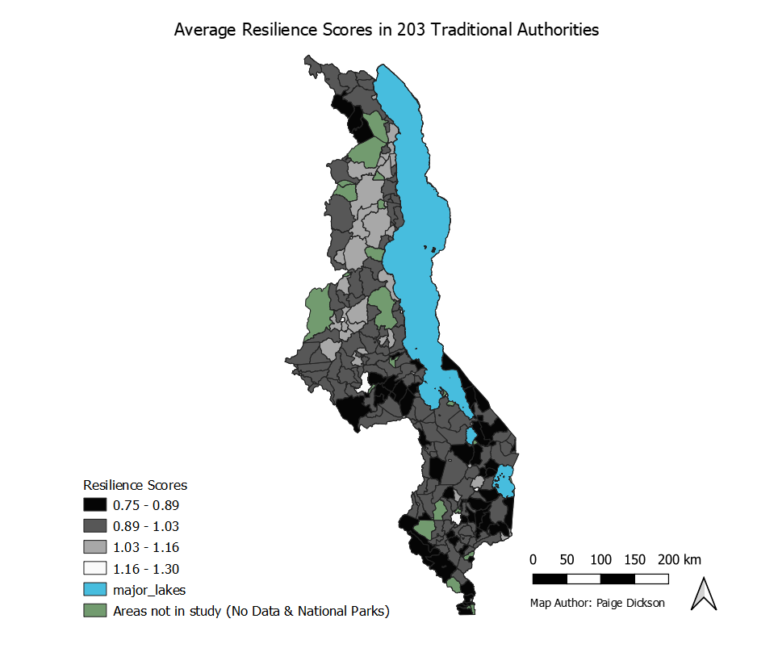
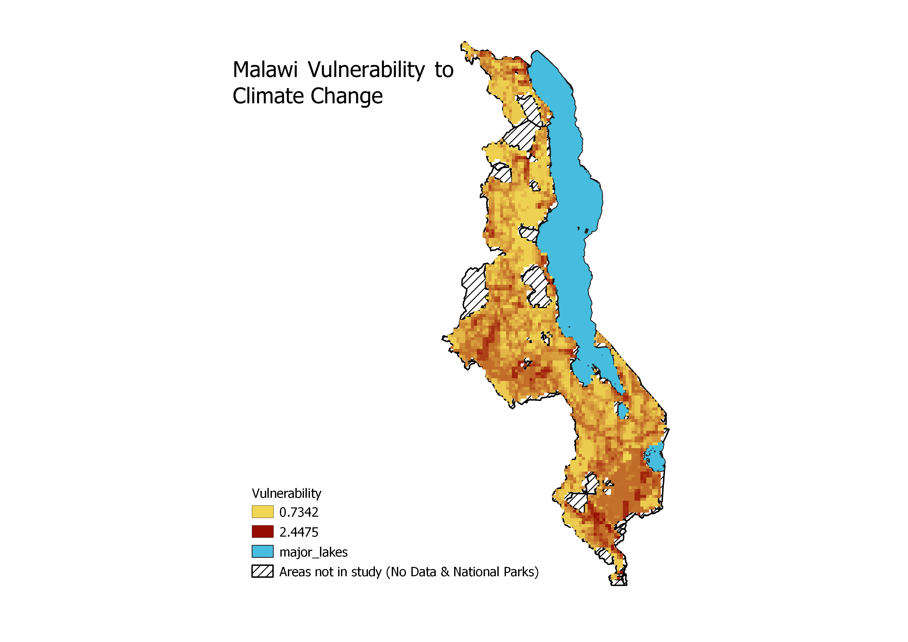

# Malawi Lab

In the seventh and eighth weeks of class, we examined replicability and reproducibility in scientific publications by looking at work by Malcomb, Weaver, and Krakowka in 2014 and their work on assessing vulnerability in Malawi.  The article can be found [here](https://reader.elsevier.com/reader/sd/pii/S0143622814000058?token=078A0ACAE18D01995A67473D93E5DC36A07C5779021CF903B8334CF1D7C8EAD9277467C394E80035D5AD73BF0FD401F0) for further context. 

The paper attempts to map social vulnerability across different scales in Malawi as a framework for visualizing and analyzing vulnerability. We attempted, to the best of our abilities, to reproduce the results produced from this study.  The authors provided a breakdown of how they assessed vulnerability, by separating it into a few distinct categories, with individual factors given specific values in each of these categories, as seen below.  The data, discussed further below, came from a variety of sources which were aggregated to create the two main maps we attempt to recreate: one of adaptive capacity and one of vulnerability overall.

# Data

Our sources for this exercise were DHS survey data, which filled in the adaptive capacity scores, and physical exposure data from UNEP Global Risk Map.  However, this only accounts for 80% of the data collected for this analysis as the livelihood sensitivity data from FEWSnet was unavailable to us.  Additionally, Professor Holler had to apply and receive special access to this data, so it cannot be freely redistributed. In addition to the inability to collect all of the adequate data to conduct a similar analysis, this article also didn't specify the specific data taken from the surveys and risk map to calculate vulnerability.  The authors of the work likely utilized personal connections to collect the DHS data, leaving the exact data unclear to us as outsiders.

## Resilience Methodology
The basic steps of this work include combining the different sources of data to create an aggregate raster which demonstrates vulnerability across the country of Malawi.  The first step we undertook in order to accomplish this was to create a score of resilience for each of the traditional authorities.  This data came from the DHS Surveys and combined the 12 features shown in the image above.  Malcomb et al. created their measurement of adaptive capacity by dividing the individual factors of the aggregation into quintiles.  However, they did not specify how they handled points with null values or how they chose to separate answers that functioned binarily.  As a class, we created the following [SQL Script](vulnerability.sql) in which we divided the individual categories into quintiles where applicable and two groups where applicable.  The factors were ranked from 1-5 based on how we judged the trait to increase or decrease vulnerability.  Below, is a comparison of our final map of resilience based on our calculations versus the initial produced by Malcomb. 

 

## Resilience Discussion

Clearly, these maps are not identical, though they do share general trends of similarity throughout.  There are many potential reasons for the discrepancies present in this lab.  One of the most important reasons, as discussed above, is due to our uncertainty in the creation of the quintiles themselves and how they were measured.  Without an understanding of how specifically the authors classified each of the points, a concrete workflow cannot be created which mirrors the original. Another possible issue for this analysis is the lack of certainty with the DHS surveys themselves.  One major factor is that these individual level surveys have innate error with either lack of reporting or incorrect reporting.  Another important factor is the lack of geographical certainty, which I examined [here](final.md) in my final project for the class.  

## Vulnerability Methodology

The second map we attempted to recreate for this analysis was the final map created by Malcomb et al.  This was the cumulative map of vulnerability which compiled the three main areas of vulnerability.  The first, adaptive capacity, was discussed above.  The second, physical exposure, was compiled from flood risk and drought exposure in Malawi.  And the final, livelihood sensitivity, unfortunately remained unavailable to us from FEWSnet.

In order to create the cumulative maps of vulnerability, we created a [model](mowdel.model3) in QGIS which combined to form the 80% of the vulnerability studied by Malcomb et al.  The model has a few key steps, first, it transforms the adaptive capacity score above to a raster, so it can be aggreated with the other available rasters.  Second, it combines the draught and flood layers to be consistent with the outline of Malawi, as they were not both available at the national level.  Third, since the raster are available in different sizes, the model warps the rasters to have the same size of cell, which can be adjusted by the user at the outset.  

Once the model has created all of the desired rasters, there are a few more important steps to produce the final output grid.  First, the drought and flood clips need to be transformed into quintiles.  The flood clip is easy, since it already is in quintiles, it can be managed in the raster calculator.  However, the drought clip needs to first be divided into quintiles with the r.Quantile function in QGIS with grass, then reclassified using r.Recode to create this separation.  The classifications created by the quantile function need to be saved as a .txt file, which can be uploaded into the recode function.  Now that they have been properly separated, the raster calculator can be used to create the 80% of the map we have access to. The following is the formula used to calculate vulnerability, to the best of our estimates.

("Recoded@1" * 0.2) + (("floodClip@1" + 1 ) * 0.2) + (( 2 - "capacityGrid@1") * 0.4) 

## Vulnerability Discussion
Again, there are significant variations between our map of vulnerability and Malcomb et al's map of the same image.  Again, clear explanation for this is that we lack 20% of the data they utilized, a clear issue for reproducibility.  An additional issue is that we aren't entirely sure we used the correct drought and flood layers for our calculations.  They use different names to refer to their choice of layer, which is inconsistent with their data citation, again creating uncertainty as an observer.  Additionally, the output raster we created to match that of Malcomb is of a finer size than some of the data available, meaning that there inherently will be differences in the results presented and the local situation.  

# Replicability and Reproducibility

Cumulatively, this effort focused a lot on reproducibility and replicability in open source geography.  Generally defined in geography as the ability to recreate the same results with the same data and the ability to recreate similar results with similar data and methodology respectively, these two issues are especially prevalent in this particular exercise.  

# Vulnerability Analysis

Software Used: QGIS 3.8.1 with Grass, PostGIS

[Return to Home Page](pdickson2.github.io)

