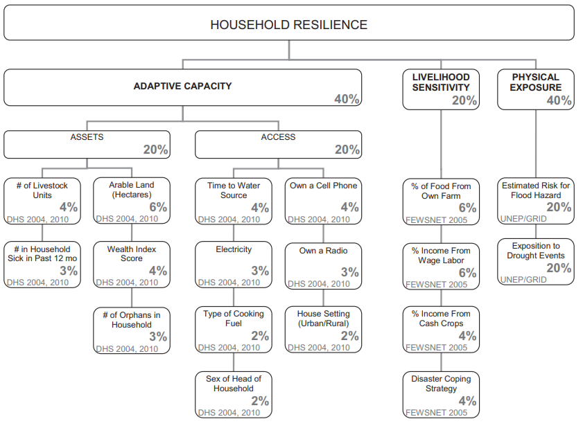
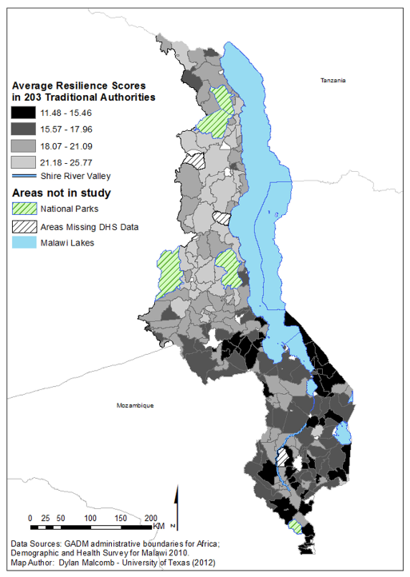
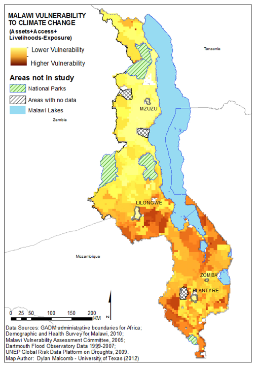

## Malawi Lab

In the seventh and eighth weeks of class, we examined replicability and reproducibility in scientific publications by looking at work by Malcomb, Weaver, and Krakowka in 2014 and their work on assessing vulnerability in Malawi.  The article can be found [here](https://reader.elsevier.com/reader/sd/pii/S0143622814000058?token=078A0ACAE18D01995A67473D93E5DC36A07C5779021CF903B8334CF1D7C8EAD9277467C394E80035D5AD73BF0FD401F0) for further context. 

The paper attempts to map social vulnerability across different scales in Malawi as a future framework for visualizing and analyzing vulnerability on a larger scale. We attempted, to the best of our abilities, to reproduce the results produced from this study.  The authors provided a breakdown of how they assessed vulnerability, by separating it into a few distinct categories, with individual factors given specific values in each of these categories, as seen below.  Our sources for this data were DHS survey data, which filled in the adaptive capacity scores and physical exposure data from UNEP Global Risk Map.  However, this only accounts for 80% of the data collected for this analysis as the livelihood sensitivity data was unavailable to us.  In addition to the inability to collect all of the adequate data to conduct a similar analysis, this article also didn't specify the specific data taken from the surveys and risk map to calculate vulnerability.  

An additional issue with attempting to create the maps below is that Malcomb et at state that they divided the adaptive capacity scores into quintiles for their analysis, but fail to describe how they handled data with null features, if they were factored in or simply discarded, in addition to lacking an explanation of how binary figures were separated.  However, the maps which we attempted to recreate are below.

Pictured below are the maps which we created with the data available to us as a class.   We altered a model, also linked below, to create these maps from the provided geometries and rasterized the variables we were able to analyze.  The model uses the vulnerability score, compiled using this [SQL](vulnerability.sql) script which we compiled as a class.  From there, the model rasterizes the vulnerability scores and normalizes and clips the flood and drought risks, the other half of the analysis which we were able to complete.  Together, this produced maps that represent about 80% of what Malcomb et al. initially produced.

This is a picture of the model created, which is linked [here](

The first map we made was a map of household adaptive capacity by Traditional Authority.

The second map we created was a grid of vulnerability, which is easily compared to the maps produced by Malcomb et al.

ADD MAPS, MODEL PICTURE, AND MODEL

Cumulatively, this effort focused a lot on reproducibility and replicability in open source geography.  Generally defined in geography as the ability to recreate the same results with the same data and the ability to recreate similar results with similar data and methodology respectively, these two issues are especially prevalent in this particular exercise.  

For a further look into the uncertainty of this data, check out my [final project](final.md) for this class, where I examined the potential inaccuracies of the DHS survey points.  

Software Used: QGIS 3.8.1 with Grass, PostGIS

Additional Data Sources: FEWSnet

[Return to Home Page](pdickson2.github.io)

