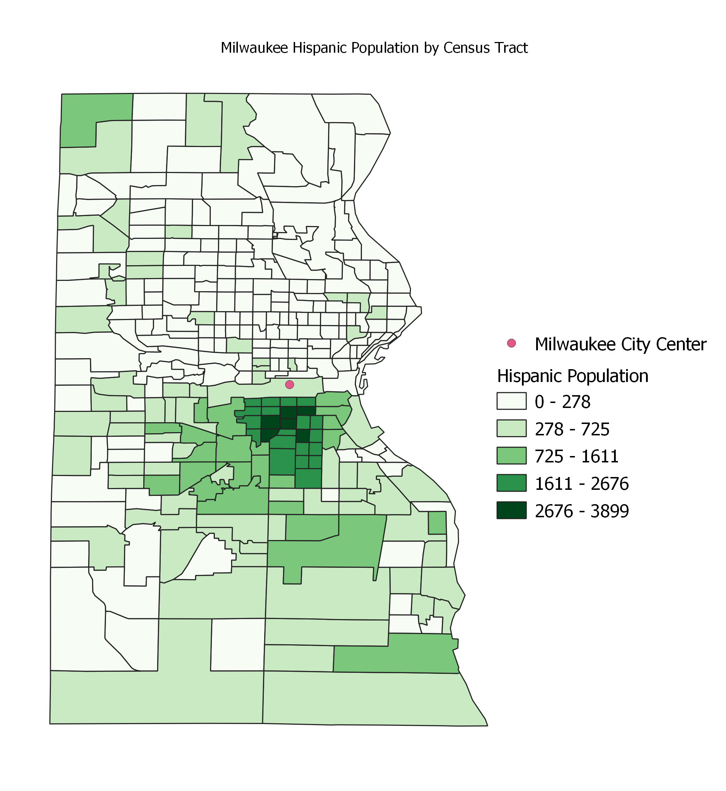
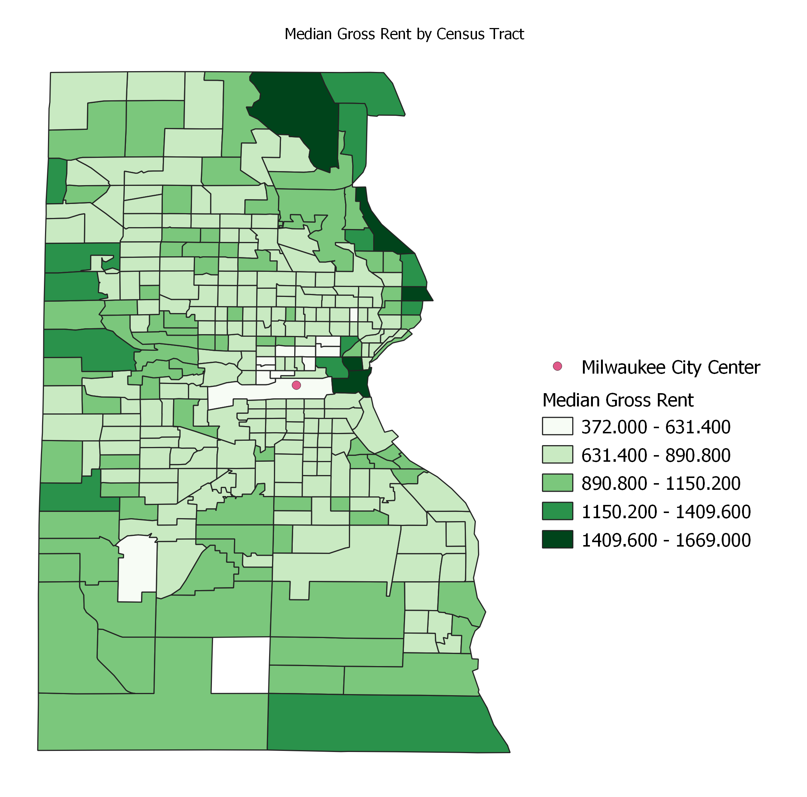

## My First QGIS Model

My first model created calculates the distance and direction from different areas to a point, the city center. It requires the creation or inclusion of a city center, which can be selected from the broader area and outputs distance and direction relative to this city center.

[Direction and Distance Model](DisDirModel.model3)

Visualization of the Model

This model was used to analyze the relationship between distance and direction from the city center, as calculated by finding the centroid of four tracts estimated near to the central business district, and the median gross income and hispanic/latinx populations of the tracts. The geopackage for this study of Milwaukee can be found [here](Milwaukee.gpkg).  Critically, this data was gathered for free from the [census data](https://factfinder.census.gov/) and [census boundaries]( https://www.census.gov/geographies/mapping-files/timeseries/geo/carto-boundary-file.htm) and used for free in QGIS, an open source platform.  Therefore, this study can be reproduced for cities across the United States with the same models.  

The images below represent the four studied factors by census tract in Milwaukee.  Visually, one can see that the median gross rent increases slightly as distance from the city center varies, with the highest rents often occurring north of the city center and along Lake Michigan, as further represented below.  

From there, we created plots of median gross income and hispanic populations as a function of distance and direction.  See below plots of the relationship between these measures in Milwaukee.  

The first plot relates distance from the city center and median gross rent in Milwaukee by census tract.
[Scatterplot of Distance and Rent](distanceplotnew.html)

The second plot relates direction from the city center and hispanic/latinx population in Milwaukee by census tract.
[Polar Plot Direction and Hispanic Ethnicity](directionplotnew.html)

This exercise draws up the question of GIS and its divergent perceptions as a tool and a science.  

[Back to Main Page](https://pdickson2.github.io/)
