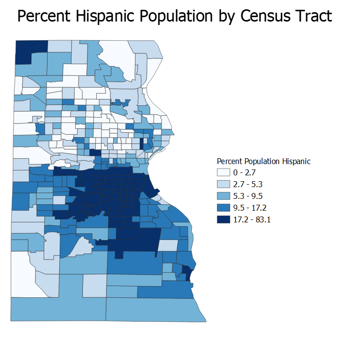

## My First QGIS Model

My first model created calculates the distance and direction from different areas to a point, the city center. It requires the creation or inclusion of a city center, which can be selected from the broader area and outputs distance and direction relative to this city center.

[Direction and Distance Model](disdirmodelnov.model3)

Visualization of the Model

This model was used to analyze the relationship between distance and direction from the city center, as calculated by finding the centroid of four tracts estimated near to the central business district, and the median gross income and hispanic/latinx populations of the tracts. The data for this study of Milwaukee can be found [here](MilwaukeeData.zip).  Critically, this data was gathered for free from the [census data](https://factfinder.census.gov/) and [census boundaries]( https://www.census.gov/geographies/mapping-files/timeseries/geo/carto-boundary-file.htm) and used for free in QGIS, an open source platform.  Therefore, this study can be reproduced for cities across the United States with the same models.  

The images below represent the four studied factors by census tract in Milwaukee.  Visually, one can see that the median gross rent increases slightly as distance from the city center varies, with the highest rents often occurring north of the city center and along Lake Michigan, as further represented below. Also, there exists a high concentration of Latinx populations just south of the city center relative to the majority of the city.   

From this data, we created plots of median gross income and hispanic populations as a function of distance and direction.  See below plots of the relationship between these measures in Milwaukee.  

The first plot relates distance from the city center and median gross rent in Milwaukee by census tract.
[Scatterplot of Distance and Rent](distanceplotnew.html)

The second plot relates direction from the city center and hispanic/latinx population in Milwaukee by census tract.
[Polar Plot Direction and Hispanic Ethnicity](directionplotnew.html)

This exercise draws up the question of GIS and its divergent perceptions as a tool and a science.  While GIS seems to be a tool for reaching final conclusions, the function of models and quantitative results necessitate the discussion of GIS as a science.  Largely, this debate stems from the variety of definitions of 'science' itself and calls into question the immense value society places on the sciences [(Wright, Goodchild, & Proctor, 1997)](https://doi.org/10.1111/0004-5608.872057).  The question comes down to whether one believes the goal of science is strictly defined as proving truths or more widely serves as a function for testing theories and analyzing data, or if it lies somewhere in between. This exercise draws conclusions in a seemingly scientific manner with concrete results, yet without the fundamental theories behind interpreting geographic data remains inconsequential.  Without and understanding of theories of urban development and how demographic factors impact one's life, the data supplied by this model would remain numbers.  Therefore, GIS is a scientific tool, but a tool nonetheless, for discovering patterns of spatial analysis that can then be interpreted with theories relating to the subject.   

Overall, open-source technology stands contrary to many of the traditional views of GIS technologies.  These include the idea that GIS is "progressing along a linear path" and "universally applicable" under a capitalist lens [(St. Martin and Wing, 2007)](https://doi.org/10.3138/carto.42.3.235).  These traditional views of GIS are often counteracted the development of open-source technologies, highlighting their importance as reliance on technology grows.  While GIS has been perceived as a universal tool of spatial analysis, open-source counteracts that assessment by providing different applications of the technology freely and openly to the public.  Therefore, open-source technologies are critical to the proliferation of GIS.  Rather than imposing industry standards that are expensive and difficult to comprehend at a basic level, open-source GIS offers a free solution with freely available code that can be altered at will and has grown exponentially since its inception [(Rey, 2009)](https://doi.org/10.1007/s10109-009-0086-8).  As with this model itself, anyone can access another's development and use it for their personal needs, rather than necessitating individual efforts.  As this model aims to be applied beyond its original scope, its existance within the open internet ensures that it can be freely used by anyone with similar goals.  Regardless of how one thinks of GIS and its role in geography, open source provides an accessible means of utilizing its functions for all.     

[Back to Main Page](https://pdickson2.github.io/)
